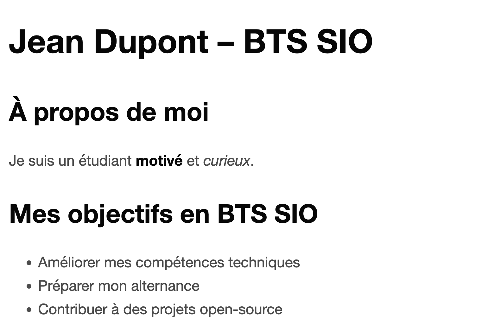
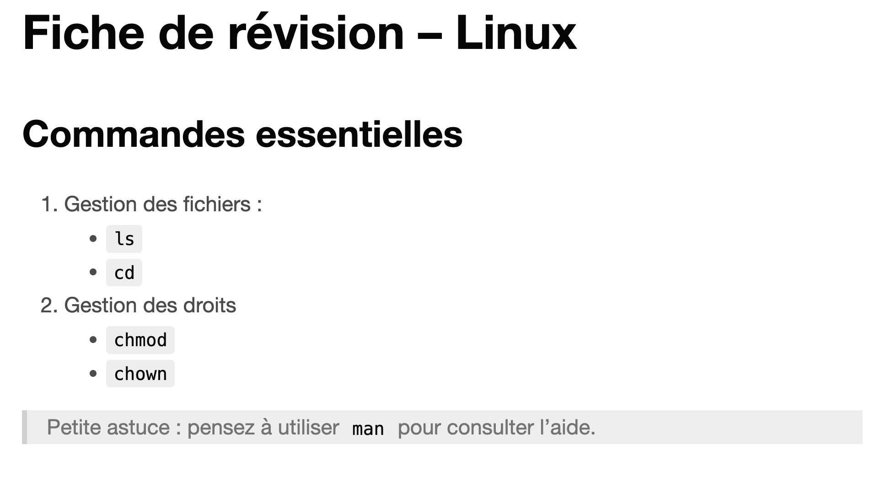
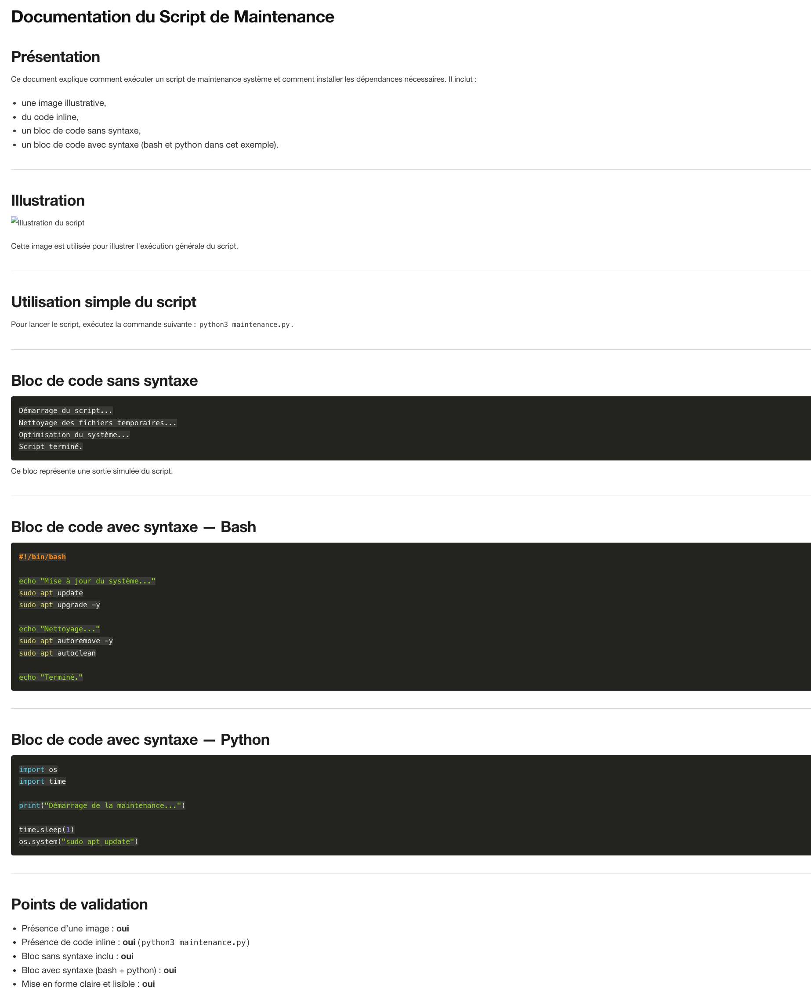
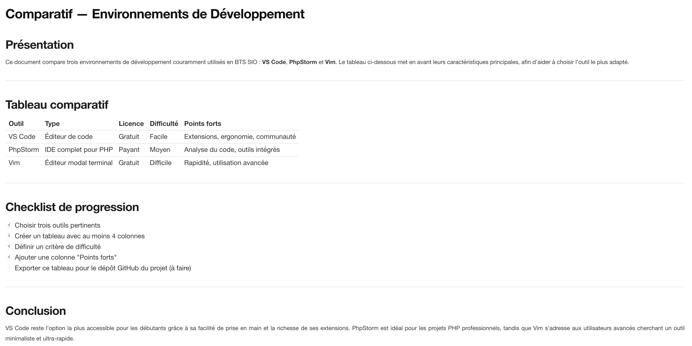
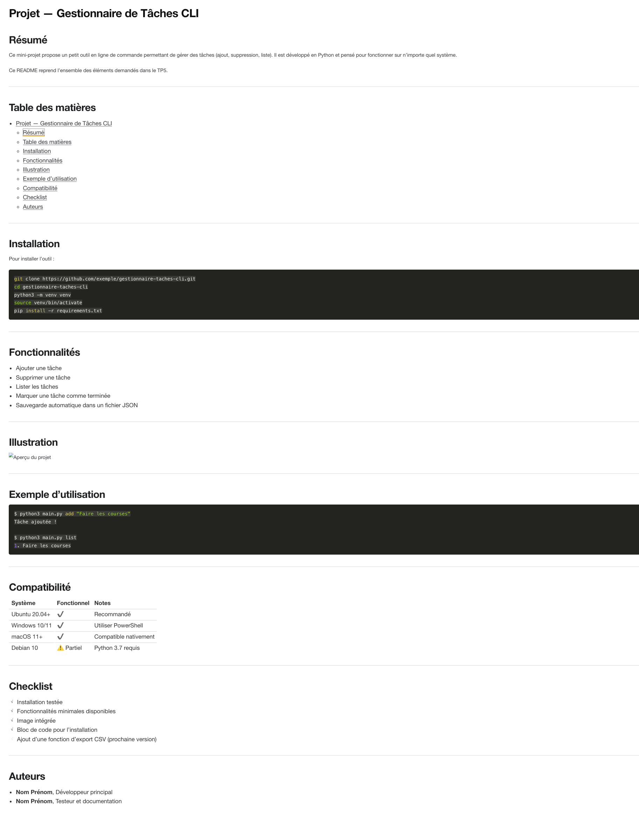

# TP 1 — Découvrir le Markdown (bases essentielles)

## Objectif

Découvrir les bases du Markdown et rédiger un premier document structuré.

## Consignes

Créez un fichier `presentation.md` contenant :

- Un titre H1 avec votre prénom et votre formation
- Un titre H2 "À propos de moi"
- Un paragraphe comprenant **du gras** et _de l’italique_
- Un titre H2 "Mes objectifs en BTS SIO"
- Une liste à puces avec au moins 3 éléments

---

## Exemple

---

---

# TP 2 — Listes, citations et liens

## Objectif

Structurer une fiche de révision en utilisant les listes, les citations et les liens.

## Consignes

Créez un fichier `fiche_revision.md` contenant :

- Un titre
- Une liste numérotée
- Une liste imbriquée
- Une citation (`>`)

---

## Exemple

---

## 

---

# TP 3 — Images, code et blocs (documentation technique)

## Objectif

Apprendre à utiliser les images, blocs de code et inline code.

## Consignes

Créez un fichier `doc.md` contenant :

- Un titre
- Une image locale ou externe
- Du code inline
- Deux blocs de code : un sans syntaxe + un avec syntaxe (bash, python ou html)

---

## Exemple

---

## 

---

# TP 4 — Tableaux, checklists et formats avancés (GFM)

## Objectif

Créer un document structuré utilisant les tableaux et checklists.

## Consignes

Créez un fichier `comparatif.md` contenant :

- Un tableau de 4 colonnes minimum
- Une checklist
- Une section "Conclusion"

---

## Exemple

---

## 

---

# TP 5 — Mini-projet : documentation d’un projet

## Objectif

Créer un README structuré et complet.

Créez un fichier `README.md` contenant :

- Un titre + résumé
- Une table des matières
- Une section "Installation" avec du code
- Une section "Fonctionnalités"
- Un tableau "Compatibilité"
- Une checklist "À faire"
- Une image ou un diagramme
- Une section "Auteurs"

---

## Exemple

---

## 

---
